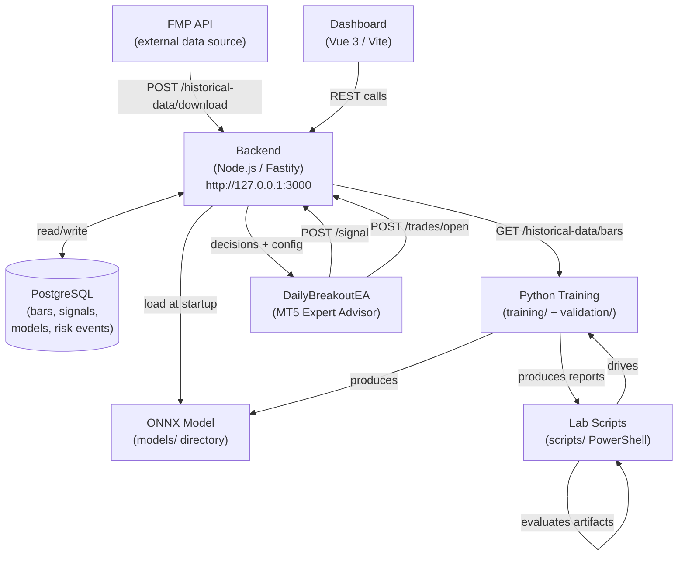
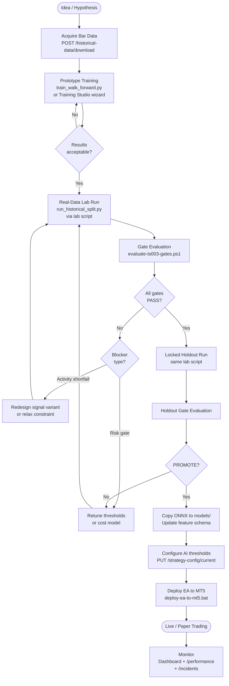
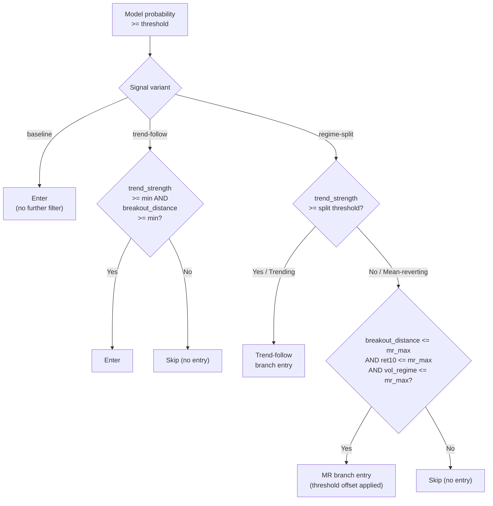
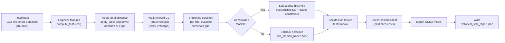
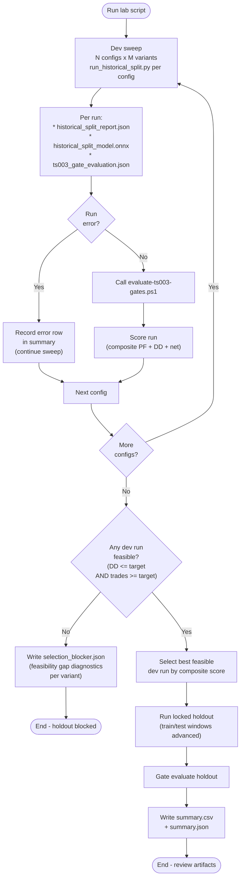
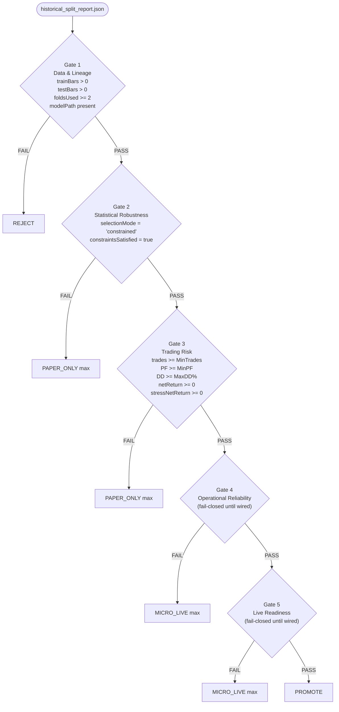
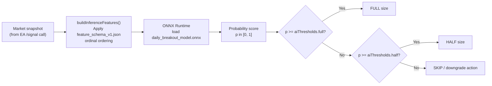
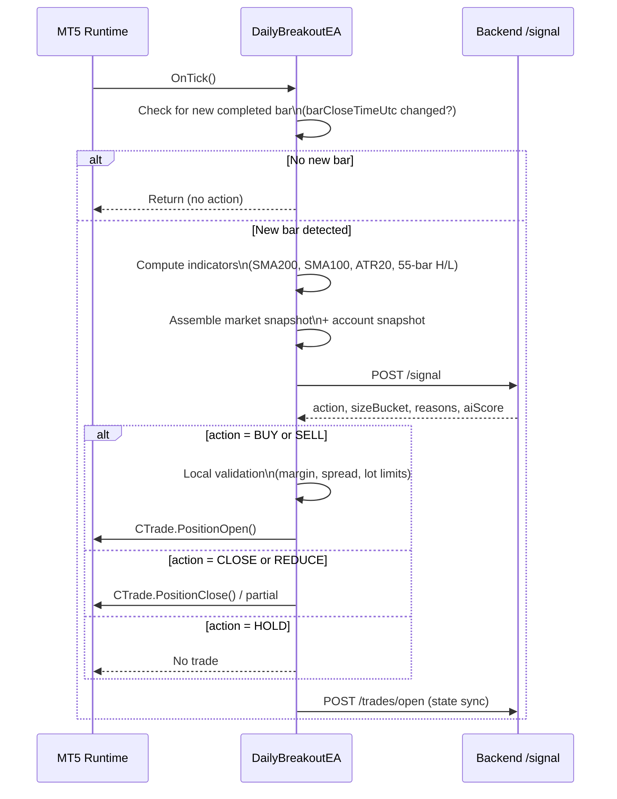
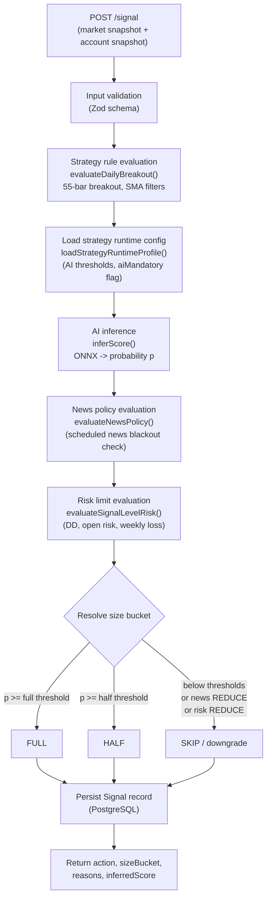

# 11 - Trading Tools Reference

Version: 1.1  
Last updated: 2026-05-28  
Audience: Strategy developer, researcher, operator

---

## Overview

This section is the complete tooling reference for the platform. It is organised around the **strategy development lifecycle** - from acquiring raw bar data, through training and validation, lab orchestration, model promotion, to live execution and monitoring.

Each tool entry covers: what it does, when to use it, inputs, outputs, and how it connects to the rest of the system.

---

## Contents

1. [Platform Architecture](#1-platform-architecture)
2. [Strategy Development Lifecycle](#2-strategy-development-lifecycle)
3. [Data Infrastructure](#3-data-infrastructure)
4. [Machine Learning Stack](#4-machine-learning-stack)
5. [Training Tools](#5-training-tools)
6. [Backtesting and Validation](#6-backtesting-and-validation)
7. [Lab Orchestration and Promotion Gating](#7-lab-orchestration-and-promotion-gating)
8. [Model Artifacts](#8-model-artifacts)
9. [Live Execution Layer](#9-live-execution-layer)
10. [Risk and Portfolio Management](#10-risk-and-portfolio-management)
11. [Strategy Configuration and Monitoring](#11-strategy-configuration-and-monitoring)
12. [Infrastructure and Operations](#12-infrastructure-and-operations)
13. [Quick Reference](#13-quick-reference)

---

## 1. Platform Architecture

The platform is a four-layer system. Raw market data feeds a backend that trains models and evaluates real-time signals. Approved signals are executed by an MT5 Expert Advisor. The dashboard provides research, configuration, and monitoring surfaces.



---

## 2. Strategy Development Lifecycle

A strategy moves through five phases before reaching live trading. Understanding which tools belong to which phase prevents misuse.



---

## 3. Data Infrastructure

### 3.1 Historical data backend routes

All bar data used by Python training pipelines comes from the backend. The backend downloads from FMP and stores bars in PostgreSQL.

| Endpoint | Method | Purpose |
|---|---|---|
| `POST /historical-data/download` | POST | Trigger a paginated download job for a symbol/timeframe/date range from FMP. Creates a `HistoricalDownloadJob` audit record. Supports M15, H1, H4, D1. H4 is synthesised by aggregating H1 bars. |
| `GET /historical-data/bars` | GET | Query stored bars by `symbol`, `timeframe`, `fromDate`, `toDate`, `limit` (max 2000). Returns OHLCV with `barCloseTimeUtc`. |
| `GET /historical-data/jobs` | GET | List download job history with status and bar counts. |

**Timeframe support matrix.**

| Timeframe | Source | Notes |
|---|---|---|
| D1 | FMP direct | Full daily OHLCV |
| H1 | FMP direct | Intraday hourly |
| H4 | Synthesised | Aggregated from stored H1 bars |
| M15 | FMP direct | Intraday 15-minute |

**Chunked retrieval.**  
`run_historical_split.py` fetches full date ranges by chunking requests to stay below the `limit=2000` bar cap per call. Chunk sizes: D1 -> 1500 days, H4 -> 300 days, H1 -> 60 days, M15 -> 10 days.

---

## 4. Machine Learning Stack

### 4.1 Python environment

All Python tools run from the virtual environment at `c:/moschops_01/.venv`.  
Dependencies are declared in `training/requirements.txt`.

| Library | Version | Role |
|---|---|---|
| scikit-learn | 1.6.1 | Logistic regression, random forest, time-series CV, calibration, evaluation metrics |
| XGBoost | 2.1.4 | Gradient-boosted trees - installed and importable, not currently default in lab scripts |
| LightGBM | 4.5.0 | Gradient-boosted trees - installed and importable, not currently default in lab scripts |
| skl2onnx | 1.18.0 | Export scikit-learn / XGBoost pipelines to ONNX format |
| onnx | 1.17.0 | ONNX model format and serialisation |
| pandas | 2.2.3 | Bar data loading, feature engineering, time-series alignment |
| numpy | 2.2.2 | Array operations, signal computation, backtest simulation |
| SQLAlchemy | 2.0.37 | Optional DB access from Python |
| psycopg | 3.2.4 | PostgreSQL driver |
| python-dotenv | 1.0.1 | Environment variable loading |

> XGBoost and LightGBM are ready to use. The model factory in `run_historical_split.py` currently defaults to logistic regression. Swapping in XGBoost or LightGBM requires no infrastructure changes - only the estimator inside the `Pipeline`.

---

### 4.2 Features computed by `run_historical_split.py`

Features are computed per bar inside `compute_features()`:

| Feature | Description |
|---|---|
| `ret1` ... `ret5` | 1-to-5-bar lagged log returns |
| `ret10` | 10-bar log return |
| `volatility20` | Rolling std dev of returns over 20 bars |
| `volatility100` | Rolling std dev of returns over 100 bars |
| `volatility_regime` | Ratio `volatility20 / volatility100` - elevated = high-vol regime |
| `above_sma` | Binary: close > 200-bar simple moving average |
| `trend_strength` | 20-bar return normalised by ATR - directional momentum measure |
| `breakout_distance` | Distance of close above/below 55-bar high/low, normalised by ATR |
| `atr_normalised` | ATR20 normalised by close price |

---

### 4.3 Signal variants

Entry logic applied after the model probability is above the threshold:



| Variant | Activity level | Best for |
|---|---|---|
| `baseline` | Highest - enters whenever probability clears threshold | Prototyping; initial calibration |
| `trend-follow` | Lower - filters to strong-trend bars | Momentum-dominant instruments |
| `regime-split` | Medium - two independent channels | Instruments with mixed trend/MR regimes |

---

### 4.4 Label objectives

The training target Y is derived from future bars using one of two modes:

| Mode | Y = 1 when | Use when |
|---|---|---|
| `direction` | future close > current close | Pure directional prediction; simpler target |
| `edge` | future return > `--min-edge-bps` basis points | Want model to ignore near-zero moves; reduces noise-trades |

---

## 5. Training Tools

### 5.1 `training/run_historical_split.py` - real-data walk-forward trainer

**What it does.**  
The primary quantitative research engine. Downloads real OHLCV bars from the backend, engineers features, trains a logistic regression model, selects a probability threshold via walk-forward cross-validation under hard constraints, evaluates a full strategy backtest on the locked test window under both base and stress cost assumptions, and exports an ONNX model.

**When to use it.**  
For all gate-quality lab runs against real bar history. Every trained artifact submitted to the gate evaluator must come from this script.

**Training workflow.**



**Full command-line argument reference.**

*Window and data:*

| Argument | Purpose |
|---|---|
| `--train-start` / `--train-end` | Training window |
| `--test-start` / `--test-end` | Locked forward-test window |
| `--symbol` | Instrument symbol (e.g. `EURUSD`) |
| `--timeframe` | `D1`, `H4`, `H1`, or `M15` |
| `--source` | Data source tag (e.g. `FMP`) |
| `--base-url` | Backend URL (default `http://127.0.0.1:3000`) |

*Model and CV:*

| Argument | Purpose |
|---|---|
| `--horizon-bars` | Bars ahead used to construct the label |
| `--walk-forward-folds` | Number of time-series CV folds |
| `--embargo-bars` | Gap bars between train and validation splits |

*Cost model:*

| Argument | Purpose |
|---|---|
| `--spread-bps` | Round-trip spread in basis points |
| `--slippage-bps` | Slippage per trade in basis points |
| `--commission-bps` | Commission per trade in basis points |
| `--stress-cost-multiplier` | Multiplier applied to all costs in the stress backtest |

*Threshold selection constraints:*

| Argument | Purpose |
|---|---|
| `--threshold-grid` | Comma-separated probability thresholds to evaluate (e.g. `0.45,0.50,0.55`) |
| `--target-max-drawdown-pct` | Hard max drawdown % constraint (e.g. `-15.0`) |
| `--target-min-median-trades` | Minimum median trades per fold constraint |
| `--fallback-min-median-trades` | Anti-degenerate floor - fallback must produce at least this many trades |

*Regime gate:*

| Argument | Purpose |
|---|---|
| `--enable-regime-gate` | Activate trend/volatility regime gate at inference |
| `--regime-min-trend-strength` | Minimum trend strength to permit entry under regime gate |
| `--regime-max-volatility-regime` | Maximum volatility ratio (vol20/vol100) to permit entry |

*Signal variant:*

| Argument | Purpose |
|---|---|
| `--signal-variant` | `baseline`, `trend-follow`, or `regime-split` |
| `--trend-min-strength` | Minimum trend strength for trend-follow branch |
| `--trend-min-breakout-distance` | Minimum breakout distance for trend-follow branch |
| `--split-trend-strength` | Trend threshold separating trend and MR branches in regime-split |
| `--mr-max-breakout-distance` | Max breakout distance for mean-reversion branch |
| `--mr-max-ret10` | Max 10-bar return for mean-reversion branch |
| `--mr-max-volatility-regime` | Max vol-regime ratio for mean-reversion branch |
| `--mr-threshold-offset` | Threshold adjustment for mean-reversion branch |

*Label objective:*

| Argument | Purpose |
|---|---|
| `--label-mode` | `direction` or `edge` |
| `--min-edge-bps` | Minimum future return in bps for `edge` label |

*Output:*

| Argument | Purpose |
|---|---|
| `--output-dir` | Directory to write all artifacts |

**Outputs.**
- `historical_split_report.json` - full diagnostic report: bar counts, walk-forward diagnostics, threshold selection mode, cost assumptions, signal variant config, regime gate config, label objective, and strategy backtest results under base and stress costs.
- `historical_split_model.onnx` - trained model ready for backend inference.

---

### 5.2 `training/train_walk_forward.py` - synthetic walk-forward trainer (wizard)

**What it does.**  
Walk-forward trainer driven by synthetic OHLCV data. Used for fast prototyping and by the dashboard Training Studio via `POST /training/runs`. Supports logistic regression and random forest, optional calibration, and three dataset volume profiles. Produces detailed ML diagnostics.

**When to use it.**  
Prototyping new model types, hyperparameter tuning, or feature experimentation without waiting for real bar downloads. Also used when launching runs from the Training Studio wizard.

**Parameters.**

| Parameter | Options | Default |
|---|---|---|
| `--model` | `logreg`, `rf` | `logreg` |
| `--dataset-profile` | `rolling-90d` (2000 rows), `rolling-180d` (3200 rows), `event-focused` (2600 rows) | `rolling-90d` |
| `--cv-folds` | Integer | `5` |
| `--horizon-bars` | Integer | `6` |
| `--calibration` | `isotonic`, `platt`, `none` | `isotonic` |
| `--include-macro` | Toggle macro-state features | |
| `--include-news-windows` | Toggle scheduled-news window features | |
| `--include-session-features` | Toggle trading session features | |
| `--enable-class-weights` | Balanced class weights for label imbalance | |

**Outputs.**
- `models/training_report.json` - full metrics including ROC-AUC, Brier score, confusion matrix, ROC/PR curves, calibration bins, and feature importance.
- `models/daily_breakout_model.onnx` - trained ONNX model, overwrites production model on success.

> **Caution.** This script writes directly to `models/daily_breakout_model.onnx`. Do not run from the wizard during live trading unless you intend to replace the active model.

---

## 6. Backtesting and Validation

### 6.1 `validation/backtest_engine.py` - rule-based backtest engine

**What it does.**  
Standalone simulation engine for the daily breakout rule-based strategy. Computes indicators (SMA200, SMA100, ATR20, 55-bar high/low), generates entry/exit signals, applies a realistic cost model, and produces a full statistics report - without any AI component. Can operate on synthetic or externally-supplied OHLCV DataFrames.

**Statistics produced.**

| Group | Statistics |
|---|---|
| Activity | Total trades, winning trades, losing trades, win rate |
| Profitability | Gross profit, gross loss, net profit, profit factor, expectancy |
| Risk-adjusted | Max drawdown (USD and %), Sharpe ratio, Sortino ratio |
| Return | Final equity, return % |

**Inputs.**  
`BacktestParams` dataclass: symbol, start/end date, starting capital, risk per trade, lookback periods, ATR period, SMA fast/trend periods, spread pips, slippage pips, commission %.

**When to use it.**  
Phase 5 baseline validation; isolating rule-based performance from AI contribution; quick sanity checks on strategy mechanics under synthetic data.

---

### 6.2 `validation/generate_baseline.py` - Phase 5 baseline runner

**What it does.**  
One-shot script that generates 252-day synthetic bar data (using a fixed seed for reproducibility), runs the backtest engine against standard v1.0 parameters, and writes the result report to `validation/baseline.md`.

**When to use it.**  
Regenerating the canonical Phase 5 baseline after any change to the rule-based strategy parameters or backtest engine logic.

**Fixed parameters (v1.0).**  
EURUSD, 252 days, $10,000 capital, 0.5% risk per trade, 55-bar lookback, ATR20, SMA100/SMA200, 2.0 pip spread, 1.0 pip slippage, 0.02% commission.

---

## 7. Lab Orchestration and Promotion Gating

Lab scripts are the outer loop around `run_historical_split.py`. They sweep configuration grids, apply fail-closed selection logic, invoke the gate evaluator, and produce structured promotion artifacts.

### 7.1 Lab sweep flow



---

### 7.2 `scripts/run-ts003-h4-lab.ps1` - TS-003 H4 lab

**What it does.**  
Fail-closed lab for TS-003 on H4 bars. Sweeps a configurable grid of horizon/fold/embargo/threshold configurations across two signal variants (trend-follow and regime-split) using `run_historical_split.py`. Invokes the gate evaluator after each run. Blocks holdout if no feasible dev run exists.

**Active configuration (top of file).**

| Variable | Current value | Purpose |
|---|---|---|
| `targetMaxDd` | -15.0% | Hard drawdown gate |
| `targetMinMedianTrades` | 120 | Hard activity gate |
| `fallbackMinMedianTrades` | 5 | Anti-degenerate fallback floor |
| `labelMode` | `edge` | Training objective |
| `minEdgeBps` | 8.0 | Minimum edge for edge label |
| `enableRegimeGate` | `$true` | Regime gate active |
| `regimeMaxVolatilityRegime` | 1.8 | Max vol-regime ratio |
| Dev window | 2014-2022 train / 2022-2024 test | Configuration selection window |
| Holdout window | 2014-2024 train / 2024-2026 test | Locked forward test |

**Variants swept.**
- `trend-follow` - trend strength and breakout distance filters
- `regime-split` - dual-channel trend/mean-reversion

**Outputs (per lab run in `docs/09-training-runs/runs/<timestamp>-ts003-h4-lab/`).**
- `summary.csv`, `summary.json` - all dev and holdout rows
- `selection_blocker.json` - written when no feasible dev run exists; includes `maxTradesObserved`, `tradeCountShortfallVsTarget`, `bestObservedMaxDrawdownPct` per variant
- Per config: `historical_split_report.json`, `historical_split_model.onnx`, `ts003_gate_evaluation.json`

---

### 7.3 `scripts/run-ts001-10run-lab.ps1` - TS-001 D1 lab

**What it does.**  
TS-001 D1 fail-closed lab. Sweeps 9 configurations with varying horizon (3/5/7/10 bars), fold counts (5/6/7), embargo (5/10 bars), and threshold grids. Selects best dev run by composite score weighted on net return, profit factor, stress profit factor, stress net return, and drawdown. Runs locked holdout on the winner.

**Composite scoring formula.**  
`score = netReturn + (PF x 8) + (stressPF x 6) + (stressNet x 0.5) + (DD x 0.8)`  
Penalty of -20 if trades < 80 or DD < -25%.

**Fail-closed flag.**  
`--AllowFallbackSelection` - permits holdout to proceed even when no dev run meets both DD and trade constraints.

**Active windows.**  
Dev: 2012-2022 train / 2022-2024 test. Holdout: 2012-2024 train / 2024-2026 test.

---

### 7.4 `scripts/run-ai-training.ps1` - wizard training runner

**What it does.**  
Single-run orchestrator for `train_walk_forward.py`. Generates a structured `RUN_REPORT.md` per run and maintains a cumulative `TRAINING_RUN_INDEX.md` summarising all runs with their score, verdict, trades, profit factor, and net profit.

**Parameters.**

| Parameter | Options |
|---|---|
| `-Model` | `logreg`, `rf` |
| `-DatasetProfile` | `rolling-90d`, `rolling-180d`, `event-focused` |
| `-CvFolds` | Integer |
| `-HorizonBars` | Integer |
| `-Calibration` | `isotonic`, `platt`, `none` |

**Outputs.**  
`docs/09-training-runs/runs/<timestamp>/RUN_REPORT.md`, updated `docs/09-training-runs/TRAINING_RUN_INDEX.md`.

---

### 7.5 `scripts/evaluate-ts003-gates.ps1` - deterministic gate evaluator

**What it does.**  
Reads a `historical_split_report.json` and deterministically evaluates five promotion gates. Produces a `ts003_gate_evaluation.json` alongside the input report with a binary PASS/FAIL per gate and an overall promotion decision.

**Gate definitions and evaluation logic.**



**Configurable thresholds.**

| Parameter | Default |
|---|---|
| `-MaxDrawdownPct` | -15.0% |
| `-MinTrades` | 120 |
| `-MinProfitFactor` | 1.05 |
| `-MinNetReturnPct` | 0.0 |
| `-MinStressNetReturnPct` | 0.0 |

**Decision levels (ascending).**  
`REJECT` -> `PAPER_ONLY` -> `MICRO_LIVE` -> `PROMOTE`

All five gates must pass for `PROMOTE`. A single gate failure caps the maximum permitted deployment level.

---

## 8. Model Artifacts

These files in `models/` are the live inference resources used by the backend at runtime.

| File | Purpose |
|---|---|
| `models/daily_breakout_model.onnx` | Active ONNX model. Loaded by `inferScore()` in the backend. Replaced when a lab run is promoted. |
| `models/feature_schema_v1.json` | Defines input feature names, order, and expected ranges. Must stay in sync with the ONNX model's input tensor. |
| `models/training_report.json` | Diagnostics and metadata from the most recent completed training run. |

**Inference path at runtime.**



> The feature schema is versioned (`v1`). When training produces a model with a different feature set, the schema file must be updated and the version incremented before the model can be used in production.

---

## 9. Live Execution Layer

### 9.1 `mql5/Experts/DailyBreakoutEA.mq5` - MT5 Expert Advisor

**What it does.**  
The live execution agent. Runs inside MetaTrader 5, polls for completed bars, assembles a market snapshot, calls the backend `/signal` endpoint, and acts on the response via MT5's `CTrade` API.

**Bar-by-bar execution loop.**



**Fallback behaviour.**  
If the backend is unreachable: no new entries are opened. Any active protective stop-loss orders remain in force. The EA logs the connectivity failure and resumes when the backend is responsive.

**Daily loss guard.**  
Enforced locally inside the EA regardless of backend response. If the daily loss threshold is breached, the EA stops opening new positions for the remainder of the UTC trading day.

**Deployment.**  
Run `scripts/deploy-ea-to-mt5.bat` to copy `DailyBreakoutEA.mq5` into the MT5 terminal `Experts/` data directory and trigger recompilation.

---

### 9.2 Backend `/signal` pipeline

**What it does.**  
Receives a market snapshot from the EA, runs the full decision chain, persists the signal record, and returns a structured action.

**Decision pipeline.**



---

## 10. Risk and Portfolio Management

### 10.1 `/risk-check` - standalone risk evaluation

**Purpose.**  
Evaluate proposed risk against current account state without a full signal evaluation. Useful for pre-trade position sizing checks or portfolio-level capacity queries.

**What it checks.**  
Open risk vs. `maxOpenRisk` limit, open trade count vs. `maxOpenTrades` limit, daily loss % vs. limit, weekly loss % vs. limit, and news policy for the symbol.

**Returns.**  
`approved`, `vetoReasonCodes`, `adjustedSize`, `evaluatedAtUtc`.

**Side effect.**  
Writes a `RiskEvent` DB record whenever a veto or reduction is triggered (for audit trail).

---

### 10.2 `/portfolio` - portfolio-level management

**Endpoints.**

| Endpoint | Method | Purpose |
|---|---|---|
| `GET /portfolio/summary` | GET | Aggregated portfolio view: latest portfolio decision, open trade snapshots, recent decision items, risk budget utilisation, trade slot utilisation. Accepts `maxOpenRisk`, `maxOpenTrades`, `lookback` query params. |
| `POST /portfolio` | POST | Evaluate a batch of proposed trade plans against current account state. Returns approved/rejected plans with remaining risk budget and slot counts. Persists a `PortfolioDecision` record. |

**Asset class tagging.**  
The portfolio service automatically classifies symbols: `XAU/XAG` -> Metals, 6-char FX pairs -> FX, US/JP/DE-containing -> Index.

---

## 11. Strategy Configuration and Monitoring

### 11.1 Strategy configuration

| Endpoint | Method | Purpose |
|---|---|---|
| `GET /strategy-config/current` | GET | Read active strategy runtime settings: AI thresholds (`full`, `half`), `aiMandatory` flag, training defaults (dataset profile, horizon, CV folds, calibration, feature toggles). |
| `PUT /strategy-config/current` | PUT | Persist updated settings. Validated: `aiThresholds.half` must be strictly less than `aiThresholds.full`. |

**AI threshold semantics.**
- `aiThresholds.full` - probability required for a full-size entry
- `aiThresholds.half` - probability required for a half-size entry
- `aiMandatory` - if `true`, a HOLD action is returned when the model is unavailable instead of proceeding rule-only

---

### 11.2 Model and performance metrics

| Endpoint | Method | Purpose |
|---|---|---|
| `GET /model-version` | GET | Current active model version record (strategyId, strategyVersion, modelVersion, lifecycleState). |
| `GET /performance` | GET | Last 50 persisted `PerformanceSnapshot` records. |
| `GET /score-distribution` | GET | Histogram of AI probability scores from recent signal evaluations. Accepts `bins` (5-20), `lookback` (50-5000), `strategyId`. Useful for detecting model drift or threshold miscalibration. |

---

### 11.3 Trades, incidents, and health

| Endpoint | Method | Purpose |
|---|---|---|
| `GET /trades/open` | GET | Current open trade snapshot as last synced from the EA. |
| `POST /trades/open` | POST | EA submits its current open position state for backend persistence and dashboard display. |
| `GET /incidents` | GET | Active and historical incident records. |
| `POST /incidents/:id/acknowledge` | POST | Operator acknowledges an incident with persisted audit trail. |
| `GET /health` | GET | Backend health including DB connectivity, Python environment status, and model availability. |
| `GET /news` | GET | Recent news events used by the news policy engine for blackout decisions. |
| `GET /logs` | GET | Structured file log entries for operational review. |

---

## 12. Infrastructure and Operations

### 12.1 Development environment scripts

| Script | Purpose |
|---|---|
| `scripts/start-dev-stack.bat` | Start backend + PostgreSQL together in dev mode |
| `scripts/start-backend-dev.bat` | Start backend only in watch/dev mode |
| `scripts/start-backend-prod.bat` | Start backend in production mode |
| `scripts/start-dashboard-dev.bat` | Start Vue 3 dashboard in Vite dev server mode |
| `scripts/start-db.bat` | Start PostgreSQL container via Docker Compose |
| `scripts/stop-db.bat` | Stop PostgreSQL container |
| `scripts/init-backend.bat` | Install Node.js dependencies and run Prisma migrations |
| `scripts/install-node-modules.bat` | Install all Node.js module dependencies |
| `scripts/check-local-health.bat` | Probe backend health endpoint and DB connectivity |

### 12.2 EA deployment

| Script | Purpose |
|---|---|
| `scripts/deploy-ea-to-mt5.bat` | Copy `DailyBreakoutEA.mq5` to the configured MT5 terminal `Experts/` data path and trigger recompile |

### 12.3 Backend admin route

| Endpoint | Method | Purpose |
|---|---|---|
| `POST /admin/reset` | POST | Development-only reset of database state. Guarded by environment check. |

---

## 13. Quick Reference

### Tool selection guide

| I want to... | Use this |
|---|---|
| Download real historical bars for training | `POST /historical-data/download` (then verify with `GET /historical-data/jobs`) |
| Train a model on real bars and produce a gate-ready artifact | `training/run_historical_split.py` |
| Prototype a new model type or feature set without waiting for data | `training/train_walk_forward.py` |
| Run a structured multi-config dev/holdout lab for TS-001 (D1) | `scripts/run-ts001-10run-lab.ps1` |
| Run a structured multi-config dev/holdout lab for TS-003 (H4) | `scripts/run-ts003-h4-lab.ps1` |
| Evaluate whether a specific run artifact meets promotion gates | `scripts/evaluate-ts003-gates.ps1 -ReportPath <path>` |
| Launch a training run from the dashboard Training Studio | Dashboard -> Training -> `POST /training/runs` |
| Run the rule-based baseline backtest standalone | `validation/generate_baseline.py` |
| Understand what the active model expects as input | `models/feature_schema_v1.json` |
| Update AI thresholds without retraining | `PUT /strategy-config/current` |
| See the AI score distribution from live signal history | `GET /score-distribution` |
| Deploy the EA to MT5 | `scripts/deploy-ea-to-mt5.bat` |
| Start the full local dev stack | `scripts/start-dev-stack.bat` |
| Check that all local services are up | `scripts/check-local-health.bat` |

### Common lab command patterns

**Run TS-003 H4 lab (fail-closed).**
```powershell
cd c:\moschops_01
& scripts\run-ts003-h4-lab.ps1
```

**Run TS-001 D1 lab (fail-closed).**
```powershell
cd c:\moschops_01
& scripts\run-ts001-10run-lab.ps1
```

**Evaluate a specific report against gates.**
```powershell
& scripts\evaluate-ts003-gates.ps1 `
  -ReportPath "docs\09-training-runs\runs\<timestamp>\artifacts\historical_split_report.json" `
  -MaxDrawdownPct -15.0 `
  -MinTrades 120
```

**Single real-data training run (manual).**
```powershell
c:/moschops_01/.venv/Scripts/python.exe training/run_historical_split.py `
  --train-start 2014-01-01 --train-end 2022-12-31 `
  --test-start 2023-01-01 --test-end 2024-12-31 `
  --symbol EURUSD --timeframe H4 --source FMP `
  --horizon-bars 5 --walk-forward-folds 5 --embargo-bars 5 `
  --spread-bps 2.0 --slippage-bps 1.0 --commission-bps 0.5 `
  --stress-cost-multiplier 2.0 `
  --threshold-grid 0.45,0.50,0.55,0.60 `
  --target-max-drawdown-pct -15.0 --target-min-median-trades 120 `
  --signal-variant trend-follow --label-mode edge --min-edge-bps 8.0 `
  --output-dir docs/09-training-runs/runs/manual-test/artifacts
```

**Download H4 bars for a date range.**
```bash
curl -X POST http://127.0.0.1:3000/historical-data/download \
  -H "Content-Type: application/json" \
  -d '{"symbol":"EURUSD","timeframe":"H4","fromDate":"2014-01-01","toDate":"2024-12-31","source":"FMP"}'
```
