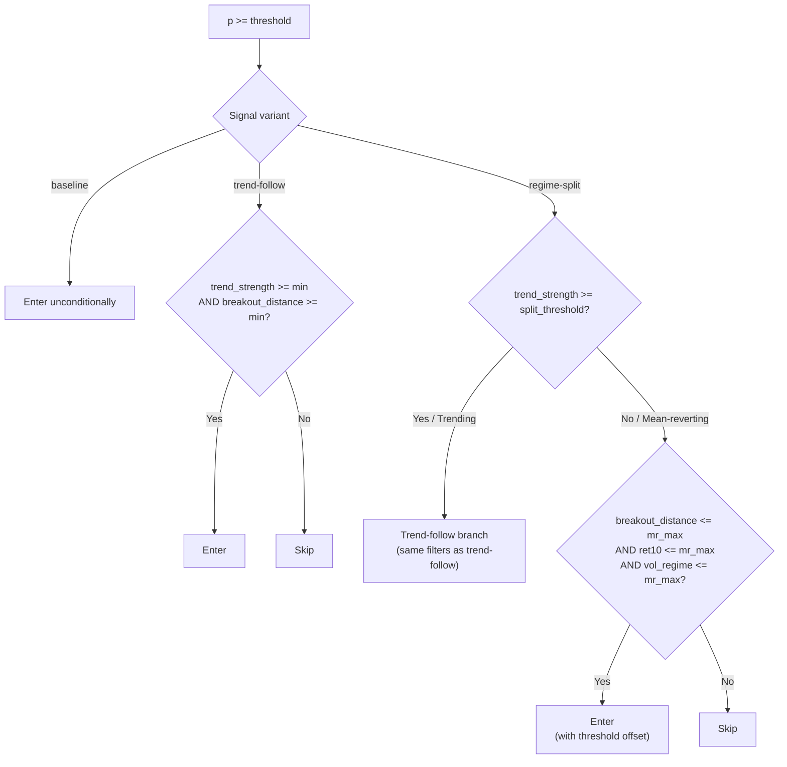
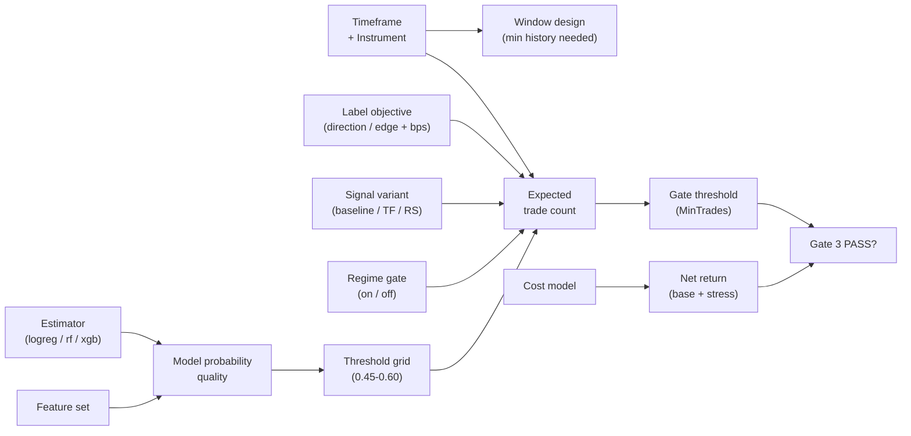

# Strategy Design Palette

Version: 1.0  
Last updated: 2026-05-28  
Audience: Strategy developer, researcher

---

## Purpose

A strategy on this platform is assembled from a set of composable design choices — the **palette**. This document enumerates every dimension you can configure, the available options, the trade-offs involved, and the constraints that bind them.

Use this document when designing a new strategy from scratch. Use `platform-tooling-reference.md` for the mechanics of every tool involved.

---

## Contents

1. [The Design Dimensions](#1-the-design-dimensions)
   - 1.1 Instrument and Timeframe
   - 1.2 Model Estimator
   - 1.3 Feature Set
   - 1.4 Label Objective
   - 1.5 Signal Variant
   - 1.6 Regime Gate
   - 1.7 Probability Threshold Strategy
   - 1.8 Walk-Forward CV Design
   - 1.9 Training Window Design
   - 1.10 Cost Model
   - 1.11 Promotion Gate Thresholds
2. [How the Dimensions Interact](#2-how-the-dimensions-interact)
3. [What Requires Code Changes](#3-what-requires-code-changes)
4. [Current Palette by Recipe Step](#4-current-palette-by-recipe-step)
5. [Recipe: Designing a New Strategy](#5-recipe-designing-a-new-strategy)
6. [Known Constraints and Gotchas](#6-known-constraints-and-gotchas)

---

## 1. The Design Dimensions

### 1.1 Instrument and Timeframe

The first two choices set everything else — they determine data availability, expected trade frequency, and appropriate constraint targets.

**Instruments.**  
Any symbol for which bar data has been downloaded via `POST /historical-data/download`. EURUSD is the only symbol with proven end-to-end lab runs. Any FX major or metal with sufficient history is a valid candidate.

**Timeframes available.**

| Timeframe | Bars per trading day | ~Trade frequency (H4 baseline) | Chunk size for download |
|---|---|---|---|
| D1 | 1 | 5-20 trades / month | 1500 days per request |
| H4 | 6 | 20-80 trades / month | 300 days per request |
| H1 | 24 | 80-200 trades / month | 60 days per request |
| M15 | 96 | 200+ trades / month | 10 days per request |

**Trade-offs.**  
Lower timeframes produce more trades, which is easier to satisfy activity gates, but signals are noisier and transaction costs consume more of the edge. Higher timeframes have cleaner signals but require longer history to accumulate enough trades to satisfy gate constraints.

**Minimum history rules of thumb.**

| Timeframe | Minimum training window | Recommended |
|---|---|---|
| D1 | 5 years | 8-10 years |
| H4 | 4 years | 8 years |
| H1 | 2 years | 4 years |
| M15 | 1 year | 2 years |

---

### 1.2 Model Estimator

All estimators produce calibrated probability outputs and export via `skl2onnx` to ONNX for backend inference.

| Estimator | Where available | Status | Characteristic |
|---|---|---|---|
| Logistic Regression | `run_historical_split.py`, `train_walk_forward.py` (`--model logreg`) | Default / production-ready | Linear decision boundary; fast to train; well-calibrated; interpretable coefficients |
| Random Forest | `train_walk_forward.py` only (`--model rf`) | Prototyping only | Non-linear; slower; can overfit on short windows; useful to benchmark against logreg |
| XGBoost | Pipeline swap (code change) | Ready to wire | Gradient-boosted trees; strong on tabular data; tends to outperform logreg on non-linear relationships |
| LightGBM | Pipeline swap (code change) | Ready to wire | Faster than XGBoost; memory-efficient; similar capability |

> XGBoost and LightGBM are installed and importable in the venv. Swapping them in for gate-quality runs requires only changing the estimator inside the `Pipeline` in `run_historical_split.py` — no infrastructure change.

**Calibration.**  
`train_walk_forward.py` exposes `--calibration isotonic|platt|none`. `run_historical_split.py` always applies isotonic calibration. Calibration maps raw model scores to well-behaved probabilities — important for threshold selection to be meaningful.

---

### 1.3 Feature Set

All features are computed per bar inside `compute_features()` in `run_historical_split.py`. The current feature set is fixed for gate-quality runs.

**Computed features (always active in `run_historical_split.py`).**

| Feature | Type | Description |
|---|---|---|
| `ret1` ... `ret5` | Continuous | 1-to-5-bar lagged log returns |
| `ret10` | Continuous | 10-bar log return |
| `volatility20` | Continuous | Rolling std dev of returns over 20 bars |
| `volatility100` | Continuous | Rolling std dev of returns over 100 bars |
| `volatility_regime` | Continuous | Ratio `volatility20 / volatility100` — elevated = high-vol regime |
| `above_sma` | Binary | Close > 200-bar SMA |
| `trend_strength` | Continuous | 20-bar return normalised by ATR20 — directional momentum |
| `breakout_distance` | Continuous | Distance above/below 55-bar high/low, normalised by ATR20 |
| `atr_normalised` | Continuous | ATR20 / close — relative volatility level |

**Optional feature toggles (`train_walk_forward.py` prototyping only).**

| Toggle | What it adds |
|---|---|
| `--include-macro` | Macro-state regime indicators |
| `--include-news-windows` | Scheduled news event proximity features |
| `--include-session-features` | Time-of-day / trading session features |

> These toggles are only available in the wizard trainer. To use them in gate-quality runs, `compute_features()` in `run_historical_split.py` must be extended and `feature_schema_v1.json` updated.

**Feature schema versioning.**  
The active model's expected inputs are defined in `models/feature_schema_v1.json`. If you add, remove, or reorder features, increment the schema version and update the file before deploying. Mismatched schema = inference failure.

---

### 1.4 Label Objective

The training target `Y` is derived from future bars. This choice controls what the model learns to predict.

| Mode | `Y = 1` when | Trades produced | Use when |
|---|---|---|---|
| `direction` | future close > current close | More — includes near-zero moves | Maximum activity; simpler target; useful to establish a ceiling on trade count |
| `edge` | future return > `--min-edge-bps` | Fewer, higher-quality | Standard choice — forces the model to ignore tiny price moves |

**`--min-edge-bps` knob.**  
The basis-point threshold for `edge` mode. Higher values = stricter = fewer positive labels = fewer trades from the model.

| Value | Character |
|---|---|
| 3-5 bps | Permissive; near-`direction` behaviour |
| 8 bps | Current lab default for H4 |
| 12-15 bps | Strict; high-confidence entries only |

---

### 1.5 Signal Variant

Applied after the model probability clears the threshold. Controls which bars are actually entered.



| Variant | Activity level | Best for | Key knobs |
|---|---|---|---|
| `baseline` | Highest | Establishing an upper-bound trade count; prototyping | None |
| `trend-follow` | Lower | Momentum-dominant instruments; TS-001 (D1) | `--trend-min-strength`, `--trend-min-breakout-distance` |
| `regime-split` | Medium | Instruments with mixed trend / mean-reversion regimes; TS-003 (H4) | `--split-trend-strength`, `--mr-max-*`, `--mr-threshold-offset` |

**`regime-split` MR branch configuration.**

| Parameter | Effect |
|---|---|
| `--split-trend-strength` | The threshold that decides which regime a bar belongs to |
| `--mr-max-breakout-distance` | MR entries only when price is not far from range; prevents chasing |
| `--mr-max-ret10` | MR entries only on recent range-bound price action |
| `--mr-max-volatility-regime` | MR entries only in moderate-vol conditions |
| `--mr-threshold-offset` | Raises the probability threshold for MR entries relative to TF entries |

---

### 1.6 Regime Gate

An independent entry filter evaluated before the signal variant check. When active, bars that fail the regime conditions are skipped regardless of model score or variant logic.

**On/off:** `--enable-regime-gate`

| Parameter | Effect |
|---|---|
| `--regime-min-trend-strength` | Blocks entries during flat-market / directionless bars |
| `--regime-max-volatility-regime` | Blocks entries during volatility spikes (`vol20/vol100` ratio too high) |

**Interaction with signal variant.**  
The regime gate and signal variant are orthogonal — both can be active simultaneously. The regime gate fires first; if it blocks the bar, the variant check is skipped.

---

### 1.7 Probability Threshold Strategy

During training, a probability threshold is selected via walk-forward cross-validation. The selection mode determines what gets promoted.

**Constrained selection (preferred).**  
The highest threshold whose walk-forward median drawdown stays within `--target-max-drawdown-pct` AND whose median trade count is above `--target-min-median-trades`. The output `selectionMode` field in the report will be `constrained`.

**Fallback selection.**  
If no threshold satisfies both constraints, the threshold that produces at least `--fallback-min-median-trades` trades is used instead. `selectionMode` = `fallback`. Gate 2 will not PASS in fallback mode.

**Threshold grid.**  
The `--threshold-grid` argument controls which candidate probability values are evaluated.

| Example grid | Character |
|---|---|
| `0.45,0.50,0.55` | Standard starting range |
| `0.45,0.50,0.55,0.60` | Wider; allows for tighter thresholds if edge warrants it |
| `0.40,0.45,0.50` | Permissive; useful when activity is the problem |

**Activity vs. risk trade-off.**  
A lower threshold = more trades + higher drawdown risk. A higher threshold = fewer trades + potentially lower drawdown. The constraint system forces a feasible balance; the knobs let you express where the acceptable region is.

**Live threshold knobs (no retraining).**  
After a model is deployed, thresholds can be adjusted live without retraining:

| Setting | Effect |
|---|---|
| `aiThresholds.full` | Probability required for a full-size entry |
| `aiThresholds.half` | Probability required for a half-size entry |
| `aiMandatory` | If `true`, block entries when model is unavailable |

Updated via `PUT /strategy-config/current`.

---

### 1.8 Walk-Forward CV Design

Controls how well the training generalises across the training window.

| Parameter | Typical range | Trade-off |
|---|---|---|
| `--walk-forward-folds` | 5-7 | More folds = better out-of-sample estimate; less data per fold |
| `--embargo-bars` | 5-10 | Larger gap = cleaner train/val boundary; wastes some training bars |
| `--horizon-bars` | 3-10 | Longer horizon = smoother labels but predicts further ahead; shorter = noisier but more immediate |

**Rules of thumb for H4.**

| Situation | Setting |
|---|---|
| Standard H4 lab run | 5 folds, 5 bars embargo, 5-bar horizon |
| Low trade count — need more activity | Reduce horizon to 3; try `direction` label |
| Overfitting suspected | Increase embargo to 10; reduce folds to 4 |
| Very long training window (8+ years) | 6-7 folds is beneficial |

---

### 1.9 Training Window Design

Three time windows define the experimental design:

```
|<------- Training window ------->|<-- Dev test -->||<---- Holdout ---->|
  2014                              2022  2024         2024   2026
```

**Dev window** (used in lab script's config sweep):  
Train period used for CV + model fitting. Test period is locked and never seen during CV.

**Holdout window** (advanced by 2 years in the lab script):  
The true out-of-sample test. Only run once, after the best dev configuration is selected. Cannot be revisited without triggering selection bias.

**Design rules.**
- Training window must precede test window with no overlap.
- Test window: minimum 12 months; 24 months preferred.
- Holdout train window = dev train + dev test; holdout test window = new unseen data.
- Do not pick holdout dates based on outcome — set them before running the lab.
- More training history generally helps; diminishing returns beyond 8-10 years for daily/H4.

**Current lab window assignments.**

| Strategy | Dev train | Dev test | Holdout train | Holdout test |
|---|---|---|---|---|
| TS-001 D1 | 2012-2022 | 2022-2024 | 2012-2024 | 2024-2026 |
| TS-003 H4 | 2014-2022 | 2022-2024 | 2014-2024 | 2024-2026 |

---

### 1.10 Cost Model

Transaction costs are explicit and must reflect realistic execution conditions.

| Parameter | Conservative baseline | Stress (2x) |
|---|---|---|
| `--spread-bps` | 2.0 bps | 4.0 bps |
| `--slippage-bps` | 1.0 bps | 2.0 bps |
| `--commission-bps` | 0.5 bps | 1.0 bps |
| `--stress-cost-multiplier` | 2.0 | — |

The stress-cost backtest runs on the same locked test window with all three cost components scaled by the multiplier. Both the **base** and **stress** net returns must be positive to pass Gate 3.

**Instrument-appropriate adjustments.**

| Instrument class | Typical spread | Notes |
|---|---|---|
| Major FX (EURUSD) | 0.5-2.0 bps | Platform default reasonable |
| Minor FX | 2.0-5.0 bps | Increase `--spread-bps` |
| Gold (XAUUSD) | 3.0-8.0 bps | Increase `--spread-bps` significantly |
| Index CFDs | 2.0-5.0 bps | Higher overnight swap costs (not modelled) |

---

### 1.11 Promotion Gate Thresholds

The promotion gate evaluator (`evaluate-ts003-gates.ps1`) has configurable thresholds. These are defaults, not fixed values.

| Gate | Parameter | Default | Relax to investigate | Tighten for high-confidence |
|---|---|---|---|---|
| Max drawdown | `-MaxDrawdownPct` | -15.0% | -20.0% | -10.0% |
| Min trades | `-MinTrades` | 120 | 60 | 150 |
| Min profit factor | `-MinProfitFactor` | 1.05 | 1.00 | 1.20 |
| Min net return | `-MinNetReturnPct` | 0.0% | -2.0% (analysis only) | 2.0% |
| Min stress net return | `-MinStressNetReturnPct` | 0.0% | -2.0% (analysis only) | 1.0% |

> Relax thresholds only for diagnostic analysis to understand where a run falls short. A run promoted with relaxed gates must document the relaxation explicitly.

---

## 2. How the Dimensions Interact



**Key interaction: activity and drawdown are in tension.**  
A lower threshold increases trades (good for `MinTrades`) but also increases drawdown (bad for `MaxDrawdownPct`). The constrained threshold selection navigates this trade-off automatically, but the constraints you set determine the feasible region. If you set `MinTrades = 120` on H4 with tight drawdown, you may find no feasible region exists — the `selection_blocker.json` will tell you the gap.

**Key interaction: variant tightness multiplies on threshold tightness.**  
A strict signal variant (e.g. `trend-follow` with high `--trend-min-strength`) reduces the effective trade count independently of the probability threshold. If both are tight simultaneously, activity can drop below gate floor.

**Key interaction: label horizon and trade quality.**  
Shorter horizon bars predict near-term price action and tend to produce more noisy trades. Longer horizon targets capture more durable moves but shifts the model away from high-frequency patterns.

---

## 3. What Requires Code Changes

Some dimensions are not in the palette without modifying source code:

| Change | Files to modify | Effort |
|---|---|---|
| Add new computed features | `compute_features()` in `training/run_historical_split.py`; update `models/feature_schema_v1.json` | Low — one function |
| Wire XGBoost / LightGBM to CLI | Model factory in `run_historical_split.py`; add `--model` arg | Low — ~20 lines |
| Add a new signal variant | `apply_signal_variant()` in `run_historical_split.py`; new CLI args | Medium |
| Add optional feature toggles to real-data trainer | `compute_features()` + new CLI args in `run_historical_split.py` | Low-Medium |
| Add a new rule-based entry strategy | `evaluateDailyBreakout()` in `backend/src/services/`; new EA logic | High |
| New instrument beyond FX / metals | Backend bar ingestion + symbol classification in portfolio service | Low |
| New timeframe below M15 | No known blockers; untested | Unknown |
| Multi-leg or basket strategies | Backend, EA, portfolio service, risk engine | High |

---

## 4. Current Palette by Recipe Step

A compact pick-list of every concrete option available at each decision point in the recipe. Use this alongside Section 5 as a quick reference — no need to cross-reference Section 1 for each choice.

---

### Step 2 — Instrument and Timeframe

| Dimension | Available now | Notes |
|---|---|---|
| Instruments | EURUSD | Confirmed bar history; others require `POST /historical-data/download` first |
| Timeframes | D1, H4, H1, M15 | D1 and H4 have active lab scripts; H1/M15 untested end-to-end |
| Bar download endpoint | `POST /historical-data/download` | Chunked automatically; verify with `GET /historical-data/jobs` |

---

### Step 3 — Label Objective

| Option | CLI flag | Status |
|---|---|---|
| Direction | `--label-mode direction` | Available |
| Edge | `--label-mode edge --min-edge-bps <n>` | Available; default in all labs |

**`--min-edge-bps` values to try.**

| Value | Character |
|---|---|
| 5 | Permissive; near-`direction` behaviour |
| 8 | Lab default for H4 |
| 12 | Strict; high-confidence entries only |
| 15 | Very strict; use only if activity permits |

---

### Step 4 — Signal Variant and Regime Gate

**Signal variants.**

| Variant | CLI flag | Status | Knobs |
|---|---|---|---|
| Baseline | `--signal-variant baseline` | Available | None |
| Trend-follow | `--signal-variant trend-follow` | Available; TS-001 default | `--trend-min-strength`, `--trend-min-breakout-distance` |
| Regime-split | `--signal-variant regime-split` | Available; TS-003 default | `--split-trend-strength`, `--mr-max-breakout-distance`, `--mr-max-ret10`, `--mr-max-volatility-regime`, `--mr-threshold-offset` |

**Regime gate (orthogonal to variant).**

| Option | CLI flag | Status |
|---|---|---|
| Enable / disable | `--enable-regime-gate` | Available |
| Trend floor | `--regime-min-trend-strength` | Available |
| Vol-regime ceiling | `--regime-max-volatility-regime` | Available; TS-003 default: 1.8 |

---

### Step 5 — Training Window

Fully configurable via CLI flags — no code changes required. Current lab defaults:

| Strategy | Train start | Train end | Test start | Test end |
|---|---|---|---|---|
| TS-001 D1 | 2012-01-01 | 2022-12-31 | 2023-01-01 | 2024-12-31 |
| TS-003 H4 | 2014-01-01 | 2022-12-31 | 2023-01-01 | 2024-12-31 |
| New strategy | Your choice | — | — | — |

Holdout windows (set in lab script config, not in `run_historical_split.py`):

| Strategy | Holdout train | Holdout test |
|---|---|---|
| TS-001 D1 | 2012-2024 | 2024-2026 |
| TS-003 H4 | 2014-2024 | 2024-2026 |

---

### Step 6 — Walk-Forward CV

| Parameter | Conservative | Lab default | Exploratory |
|---|---|---|---|
| `--walk-forward-folds` | 4 | 5 | 7 |
| `--embargo-bars` | 3 | 5 | 10 |
| `--horizon-bars` | 3 | 5 | 10 |

---

### Step 7 — Cost Model

| Parameter | Conservative (FX major) | Relaxed (minor FX / metal) |
|---|---|---|
| `--spread-bps` | 2.0 | 5.0 |
| `--slippage-bps` | 1.0 | 3.0 |
| `--commission-bps` | 0.5 | 1.0 |
| `--stress-cost-multiplier` | 2.0 | 3.0 |

---

### Step 8 — Gate Constraints

| Constraint parameter | Aspirational | H4 realistic | D1 realistic |
|---|---|---|---|
| `--target-max-drawdown-pct` | -10.0% | -15.0% | -15.0% |
| `--target-min-median-trades` | 120 | 60–80 | 40–60 |
| `--fallback-min-median-trades` | 10 | 5 | 5 |
| `--threshold-grid` | `0.50,0.55,0.60` | `0.45,0.50,0.55` | `0.45,0.50,0.55,0.60` |

---

### Step 9 — Manual Probe Run: Estimator and Features

**Estimators available in `run_historical_split.py` (gate-quality runs).**

| Estimator | Status | How to use |
|---|---|---|
| Logistic Regression | Default / wired to CLI | No action needed |
| XGBoost | Ready; requires code change | Swap estimator in `Pipeline` in `run_historical_split.py` |
| LightGBM | Ready; requires code change | Same as XGBoost |
| Random Forest | Wizard only | Only in `train_walk_forward.py --model rf` |

**Features active in `run_historical_split.py`.**  
All 9 computed features are always active. No CLI toggle — to add or remove features, edit `compute_features()`.

**Optional feature toggles (`train_walk_forward.py` prototyping only).**

| Toggle | CLI flag | Status |
|---|---|---|
| Macro state | `--include-macro` | Wizard only |
| News windows | `--include-news-windows` | Wizard only |
| Session features | `--include-session-features` | Wizard only |

---

### Step 10 — Lab Script

| Use case | Script | Config location |
|---|---|---|
| TS-001 D1 (existing) | `scripts/run-ts001-10run-lab.ps1` | Top-of-file variables |
| TS-003 H4 (existing) | `scripts/run-ts003-h4-lab.ps1` | Top-of-file variables |
| New strategy | Copy either as template; update config block | Top-of-file variables |

---

### Step 12 — Gate Evaluation

| Gate | Configurable? | Parameters |
|---|---|---|
| Gate 1 — Data and Lineage | No | Checks bar counts, fold count, model path presence |
| Gate 2 — Statistical Robustness | No | Checks `selectionMode = constrained` and `constraintsSatisfied = true` |
| Gate 3 — Trading Risk | Yes | `-MaxDrawdownPct`, `-MinTrades`, `-MinProfitFactor`, `-MinNetReturnPct`, `-MinStressNetReturnPct` |
| Gate 4 — Operational Reliability | Fail-closed | Not yet wired — always fails |
| Gate 5 — Live Readiness | Fail-closed | Not yet wired — always fails |

**Gate 3 defaults vs. alternatives.**

| Parameter | Default | Relaxed (diagnostic only) | Tightened |
|---|---|---|---|
| `-MaxDrawdownPct` | -15.0% | -20.0% | -10.0% |
| `-MinTrades` | 120 | 60 | 150 |
| `-MinProfitFactor` | 1.05 | 1.00 | 1.20 |
| `-MinNetReturnPct` | 0.0% | -2.0% | 2.0% |
| `-MinStressNetReturnPct` | 0.0% | -2.0% | 1.0% |

---

## 5. Recipe: Designing a New Strategy

Follow this sequence to go from idea to a lab-ready design without wasting runs on foreseeable failures.

**Step 1 — Define the hypothesis.**  
What market behaviour are you trying to capture? Momentum breakout? Mean reversion after extension? Document the expected edge before touching any tools.

**Step 2 — Choose instrument and timeframe.**  
Start with EURUSD H4 or D1 if you want the shortest path to a gate-quality result. Pick a timeframe whose natural trade frequency can plausibly meet the activity gate (see Section 1.1).

**Step 3 — Choose label objective.**  
Use `edge` with `--min-edge-bps 8.0` as the default. Only switch to `direction` if you expect very low activity and need to maximise trade count as a starting point.

**Step 4 — Choose signal variant.**  
Use `baseline` for an initial feasibility check (upper-bound trade count). If it passes activity gates easily, switch to `trend-follow` or `regime-split` to add selectivity.

**Step 5 — Set the training window.**  
Use the current lab defaults unless you have a reason to diverge:  
- H4: `2014-2022` train / `2022-2024` test  
- D1: `2012-2022` train / `2022-2024` test  
Never pick windows based on knowing the outcome.

**Step 6 — Set walk-forward CV parameters.**  
Start with `--walk-forward-folds 5 --embargo-bars 5 --horizon-bars 5`. Adjust after seeing the diagnostic output.

**Step 7 — Set cost model.**  
Use platform defaults. Adjust only if the instrument warrants different spread/slippage assumptions.

**Step 8 — Set realistic gate constraints.**  
Set `--target-min-median-trades` at a level the timeframe can plausibly achieve. For H4 with 2 years test: 60-80 is realistic; 120 is aspirational. Run with the aspirational target first; use the selection blocker to see how close you are.

**Step 9 — Single manual run first.**  
Before launching a full lab sweep, run one configuration manually with `run_historical_split.py` to confirm the data is available, features compute, and the output looks structurally correct.

```powershell
c:/moschops_01/.venv/Scripts/python.exe training/run_historical_split.py `
  --train-start 2014-01-01 --train-end 2022-12-31 `
  --test-start 2023-01-01 --test-end 2024-12-31 `
  --symbol EURUSD --timeframe H4 --source FMP `
  --horizon-bars 5 --walk-forward-folds 5 --embargo-bars 5 `
  --spread-bps 2.0 --slippage-bps 1.0 --commission-bps 0.5 `
  --stress-cost-multiplier 2.0 `
  --threshold-grid 0.45,0.50,0.55 `
  --target-max-drawdown-pct -15.0 --target-min-median-trades 80 `
  --signal-variant baseline --label-mode edge --min-edge-bps 8.0 `
  --output-dir docs/09-training-runs/runs/new-strategy-probe/artifacts
```

**Step 10 — Launch a lab sweep.**  
Use `run-ts003-h4-lab.ps1` as the template. Copy it, update the config block at the top, and add your variant to the sweep grid. A sweep over 6-9 configurations is enough to find the feasible region.

**Step 11 — Interpret the results.**  
- If holdout was blocked: read `selection_blocker.json` — it gives `maxTradesObserved` and `bestObservedMaxDrawdownPct` per variant. These tell you exactly which constraint is binding.
- If holdout ran: review `summary.csv` dev vs. holdout rows. Large dev/holdout performance gap = overfitting or lookahead; investigate embargo and horizon.

**Step 12 — Evaluate the winner against gates.**  
```powershell
& scripts\evaluate-ts003-gates.ps1 `
  -ReportPath "docs\09-training-runs\runs\<timestamp>\artifacts\historical_split_report.json" `
  -MaxDrawdownPct -15.0 -MinTrades 80
```

---

## 6. Known Constraints and Gotchas

| Constraint | Detail |
|---|---|
| XGBoost / LightGBM not wired to CLI | Both are installed but require a code change to `run_historical_split.py` to use in lab runs |
| Optional features not in real-data trainer | `--include-macro`, `--include-news-windows`, `--include-session-features` only work in `train_walk_forward.py` |
| Feature schema must stay in sync | Adding features to training without updating `feature_schema_v1.json` causes inference failure at runtime |
| `train_walk_forward.py` overwrites production model | Running it (or triggering a wizard run) replaces `models/daily_breakout_model.onnx` — do not run during live trading |
| Trade count on H4 is structurally limited | In a 2-year test window with ~500 H4 bars, max feasible trades is ~50-80 even with `baseline` + `direction`. The 120-trade gate is aspirational for H4. |
| Holdout is one-shot | Once holdout runs, the result is fixed. Re-running on the same holdout window after seeing the result introduces selection bias. |
| Gate 4 and Gate 5 are fail-closed | Both gates are wired to fail until operational readiness criteria are defined. A `PROMOTE` result from the evaluator is not currently achievable. |
| Regime-split MR channel activity | MR entries require three filters to pass simultaneously. In trending markets this channel can go silent for extended periods. |
| `--AllowFallbackSelection` weakens Gate 2 | Using this flag in TS-001 permits runs where no constrained threshold exists to proceed to holdout. These runs will fail Gate 2 (`selectionMode != constrained`). |
